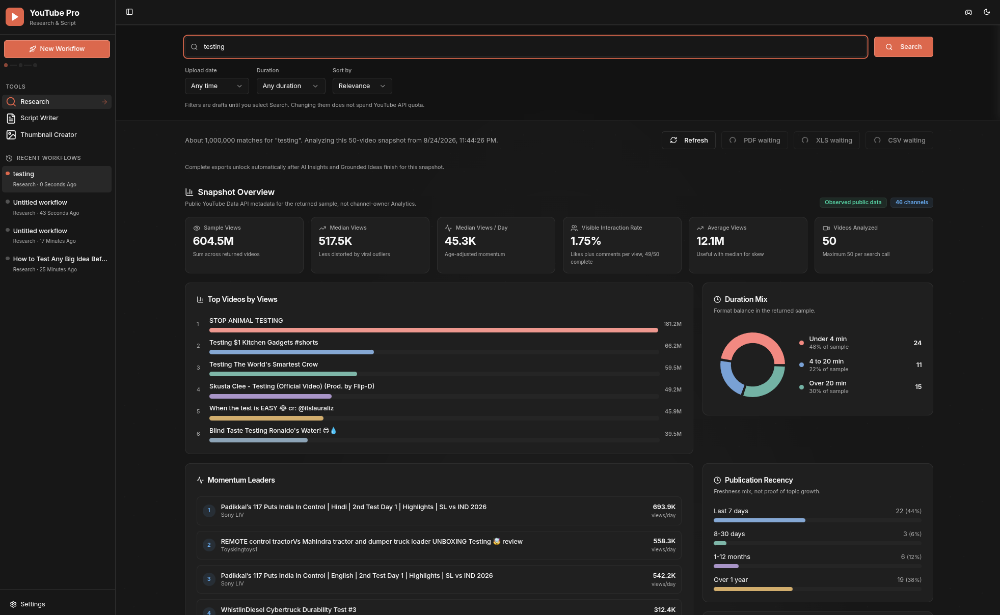
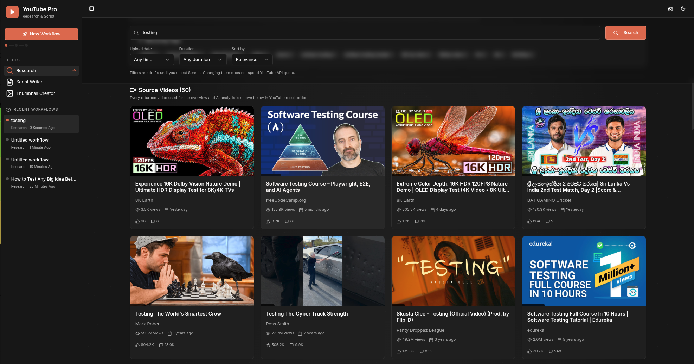
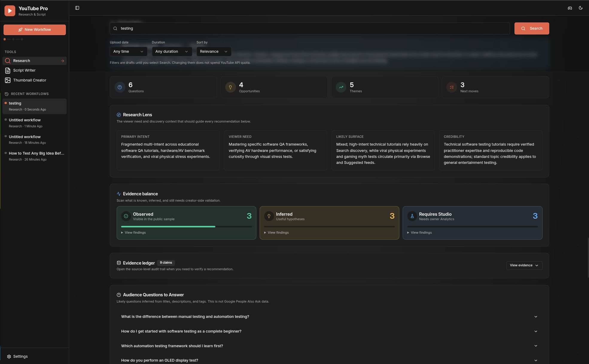
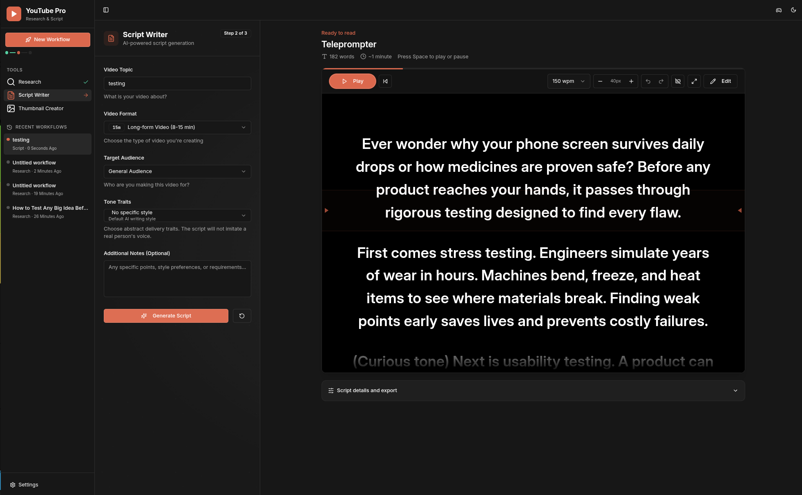
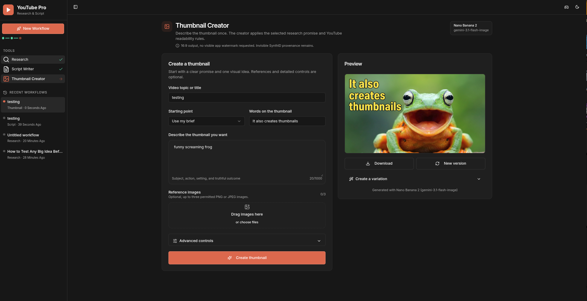

<p align="center">
  
</p>

<h1 align="center">Cutroom</h1>

<p align="center">
  Research through package in one room.
</p>

Cutroom is an evidence-grounded workspace for YouTube research, idea selection, script writing, and thumbnail creation. It combines public YouTube Data API v3 records with Gemini analysis while keeping API keys on the server.

Cutroom is an independent project. It is not affiliated with, endorsed by, or sponsored by YouTube or Google. YouTube and Google product names are trademarks of their respective owners.

## Product tour

### Research analytics

Search a topic, inspect the returned public-data snapshot, compare momentum and publication patterns, review data coverage, and continue into AI-assisted insights and ideas.



### Source videos

Review every video included in the active public-data snapshot, with thumbnails, channel information, views, publication timing, likes, and comments visible in one grid.



### AI Insights

Turn the active snapshot into a scan-first research brief with audience questions, opportunity themes, recommended moves, and a clear separation between observed evidence, inference, and metrics that require YouTube Studio.



### Script teleprompter

Turn a selected idea into an editable script, then read it in a focused teleprompter with pace, size, cue, undo, and playback controls.



### Thumbnail Creator

Describe the outcome once, add optional references or advanced controls, generate a readable 16:9 thumbnail, and create variations from the same workflow.



These screenshots come from a live local development build using public YouTube metadata. They are not generated interface mockups.

## Workflow

The product follows one continuous workflow:

1. **Research**: Search up to 50 public YouTube videos, review the overview, analytics, coverage, and every returned video.
2. **AI Insights**: Gemini analyzes the exact active research snapshot. Claims retain their snapshot identity and source video IDs, or are explicitly labeled as aggregate inference or as requiring YouTube Studio.
3. **Grounded Ideas**: Ideas generate automatically after valid Insights. Select one idea, then explicitly proceed to Script Writer.
4. **Script Writer**: Generate and edit a script from the selected idea package and its evidence. Section and paragraph regeneration use the same bounded evidence context.
5. **Thumbnail Creator**: Use the selected promise and thumbnail concept, outcome-oriented presets, editable controls, and up to three permitted references.

There is no standalone Ideas screen. The legacy `/ideas` path redirects to the Ideas section inside Research.

Each press of **New Workflow** creates a separate local project. On desktop, Settings asks you to choose a **library folder**; Cutroom stores each workflow in a topic-named subfolder (research, script, thumbnail, and package mirrors) and also keeps a browser IndexedDB mirror for fast resume. Without a library folder, workflows stay under the Cutroom app-data directory. The sidebar keeps the eight most recent workflows, lets the user rename or delete them, and reopens the last active Research, Script, Thumbnail, or Package step. After you run a research search, the workflow is auto-named from that topic. Uploaded reference images are intentionally not retained, so permission and file selection are fresh for every later generation.

## Requirements

- Node.js 20.19 or newer. Node.js 22.12 or newer is also supported by the current build toolchain.
- Rust toolchain (for desktop): `rustc` + `cargo` for `npm run tauri:dev` / `tauri:build`.
- A YouTube Data API v3 key for Research.
- A Gemini API key for Insights, Ideas, scripts, thumbnails, and publish packages.

Copy the example configuration and fill it locally:

```bash
cp .env.example .env
npm install
npm run dev
```

The server listens on `127.0.0.1:5000` by default (use another `PORT` if 5000 is taken). Open `http://127.0.0.1:$PORT`.

Desktop shell:

```bash
npm run tauri:dev
```

See [ROADMAP.md](ROADMAP.md), [TRACKER.md](TRACKER.md), [docs/DESKTOP.md](docs/DESKTOP.md), and strategy docs: [docs/STRATEGY.md](docs/STRATEGY.md) · [docs/FEATURES.md](docs/FEATURES.md) · [docs/MODELS.md](docs/MODELS.md) · [docs/RELEASE_PLAN.md](docs/RELEASE_PLAN.md) · [docs/INVESTOR_BRIEF.md](docs/INVESTOR_BRIEF.md) · [docs/USER_STORY.md](docs/USER_STORY.md) · [docs/HERMES_DECISION.md](docs/HERMES_DECISION.md) · [docs/V3_ROADMAP.md](docs/V3_ROADMAP.md) · [docs/V3_FEATURES.md](docs/V3_FEATURES.md).

You can instead start without keys and enter them in **Settings**. Settings writes replacements to the ignored `.env` file with owner-only permissions. Saved values are never returned to the browser. Settings accepts direct loopback, same-origin requests only and rejects normal forwarded or reverse-proxy requests.

## Configuration

| Variable | Purpose | Default |
| --- | --- | --- |
| `YOUTUBE_API_KEY` | YouTube Data API v3 search and enrichment | Required for Research |
| `GEMINI_API_KEY` | Gemini text and image generation | Required for AI features |
| `GEMINI_TEXT_MODEL` | Research, Ideas, Script, and regeneration model | `gemini-3.7-flash` |
| `GEMINI_IMAGE_MODEL` | Thumbnail generation model | `gemini-3.1-flash-image` |
| `PORT` | Local HTTP port | `5000` |
| `HOST` | Bind address | `127.0.0.1` |

The Settings page exposes the server allowlist and its current descriptions. Models are not hardcoded by the client. Changing the allowlist in `server/gemini-models.ts` changes the available Settings options.

## Data and request limits

- Research query: 1 to 200 characters.
- Research sample: 1 to 50 videos per search request. YouTube's overall result count is approximate and is labeled separately from the returned sample.
- Research enrichment: public video statistics, duration, captions, tags, language, topic categories, selected status fields, live-stream details, and public channel metadata when available. Missing or private public fields remain unavailable, never zero-filled.
- AI evidence input: exactly the active ordered snapshot, at most 50 videos, its deterministic aggregate analytics, enrichment coverage, warnings, filters, query, retrieval time, and snapshot ID.
- Script input: topic up to 500 characters, custom tone traits up to 300, notes up to 5,000, script or section content up to 80,000 where applicable.
- Thumbnail references: PNG or JPEG, 128 to 4096 pixels, at most 5 MB after preparation per image, 12 MB decoded total, and no more than three references. The browser also rejects source files over 10 MB before preparation.
- Global JSON body: 18 MB, needed for the bounded base64 thumbnail references. URL-encoded input is limited to 64 KB and 100 parameters.
- Billable YouTube and Gemini routes: 10 requests per client address per 60 seconds in this single-process local server.

## Privacy and access model

- There is no login screen, initial password, Thumbnail unlock, or Pro Script Studio gate.
- API keys stay server-side and `.env` is ignored.
- Recent workflow history stays in the current browser profile. It is not sent to a separate history service and never contains API keys.
- Request and response bodies are not logged.
- The application binds to loopback unless `HOST` is explicitly changed.
- Do not expose the server directly to the internet. If remote access is required, add authentication and rate limiting at a trusted gateway, and disable or separately protect local Settings.
- The in-memory rate limiter is per process. It is suitable for this local-first default, not a distributed public deployment.

Gemini image outputs include Google's invisible SynthID provenance. The application does not add a visible watermark and does not claim SynthID can be disabled.

## Commands

```bash
npm run dev       # development server
npm test          # contract and provider-behavior tests
npm run check     # TypeScript check
npm run build     # production client and server build
npm start         # run the production build
```

Continuous integration runs the test suite, TypeScript check, and production build on every pull request and push to `main`.

## Technology

- React 18, TypeScript, Vite, Tailwind CSS, and shadcn/ui
- Express 5
- Google Gemini through `@google/genai`
- YouTube Data API v3
- No server-side runtime database, session store, Passport authentication, or Replit-managed AI proxy

## Quotas and costs

YouTube search is quota-expensive compared with video and channel enrichment. Gemini limits and pricing vary by model and account. Check the current official documentation before changing models or making the server remotely accessible:

- [YouTube Data API quota costs](https://developers.google.com/youtube/v3/determine_quota_cost)
- [Gemini pricing](https://ai.google.dev/pricing)
- [Gemini image generation and SynthID](https://ai.google.dev/gemini-api/docs/image-generation)

## License

Cutroom is open source under the [Apache License 2.0](LICENSE).

## Contributing and security

See [CONTRIBUTING.md](CONTRIBUTING.md) for the local quality gate. Report security issues privately according to [SECURITY.md](SECURITY.md), never in a public issue.
